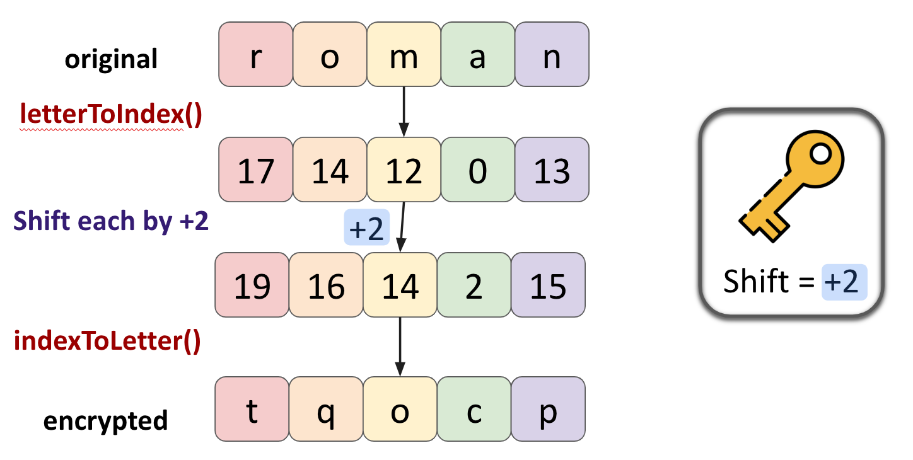
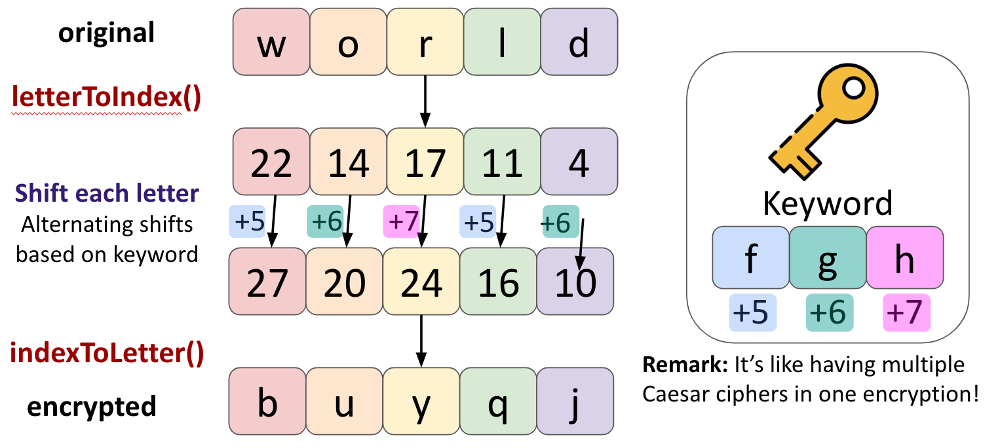

# CS 106S Week 1: JavaScript and Ciphers!

## Instructions
1. Make sure to have Google Chrome (preferably) or Safari installed.
2. Download the starter code and unzip it.
3. Inspect the folder / files in Visual Studio Code or your preferred code editor, especially `tutorial.js` and `assignment.js`.
4. Using Finder or your OS equivalent, open `index.html` in Chrome (double-clicking the file name should work). Then, type `cmd`-`option`-`j`, or `ctrl`-`shift`-`j` if on Windows, to open the JavaScript console!
5. Go through JavaScript tutorial `tutorial.js` (a more fleshed out / lecture-notes-style version is at <a href = "https://web.stanford.edu/class/cs106s/handouts/js-tutorial.html" target="_blank" rel="noopener noreferrer">this link</a>), and feel free to copy and run any code in the Console to verify its output.
6. Whenever you encounter a checkpoint in `tutorial.js`, shift over to `assignment.js` and complete the requisite `TODO`. More of this part below!

## Intro Cryptography
This workshop will introduce you with the basics of crytographic ciphers, which are widely used for keeping data secure and veiling sensitive information, such as passwords, identifying information, personal communications, digital signatures, and much more! 

## Caesar Ciphers (`assignment.js`)
Caesar ciphers work by shifting each character in a certain message we'd like to encrypt, which we call the "plaintext". The mechanism is that each character is shifted by the same number of characters; for instance, if our shift length is `1`, then `a` shifts to `b`, `b` shifts to `c`, `c` to `d`, and so forth, with `z` to `a` so that letters at the alphabet's end wrap around back to the beginning.

The diagram below illustrates encrypting message `"roman"` with a shift length of 2, where `r` (alphabet index `17`) shifts to `t` (`19`), `o` (`14`) shifts to `q` (`16`), and so on, ensuring that `"roman"` becomes `"tqocp"`, the ciphertext.



**For this endeavor, you can make the following assumptions:** (1) all text / strings will be of non-zero length, (2) all given alphabetic characters wil be lowercase, and (3) the cipher is not applied to non-alphabetic characters, and you will not encounter them. 

**To help check functionality**, after completing `TODO` functions, refresh the Chrome tab on `index.html` and check the Console to see if our sanity-check tests pass or not. Please let me know if you have any questions!

## Optional Extension: Vigenère Ciphers (also `assignment.js`)
**Completely optional:** Feel free to work on this if you'd like and have extra time in class! 

We introduce Vigenère ciphers, which are similar to Caesar ciphers (in that they also shift letters) but are slightly more elaborate. The mechanism behind them is to use **alternating shift lengths** for each plaintext letter. The **shifts are dictated by a fixed keyword** of some length, and specifically the alphabetic indices (e.g., `a=+0`,`b=+1`,...,`z=+25`) corresponding to each keyword letter. 

In precise terms, for a plaintext string, the letter at index `i` will get shifted by the alphabet index of `keyword[i % keyword.length])`, where `%` is the remainder function (you can think of `modulo` if you're familiar with clock/modular arithmetic).

An example encryption is illustrated below, with keyword `fgh` (that is, alternating shifts of `+5,+6,+7`), meaning that letters at indices `0`,`3`,`6`, etc. will get shifted by `+5`; letters at indices `1`,`4`,`7`,etc. will get shifted by `+6`; and finally, letters at indices `2`,`5`,`8`,etc. will get shifted by `+7`. Here, we are encrypting the text `world`. We observe that `w` (`22`) at string index 0 becomes `b` (`27`,+5), `o` (`14`) at string index 1 becomes `u` (`20`, +6), and so on. 



For this extension, **you'll want to complete the `encryptVigenere` function!** Then, to test your Vigenère cipher, go to the bottom of the   `assignment.js` file, and uncomment the line that reads as:
```
// testVigenere() // -- uncomment to test Vigenere cipher (optional)
```     
And you'll see functionality tests appear in the console when you refresh :) **Tip:** Use helper functions you already wrote!

## Optional Extension: Breaking the Code / Decryption (also `assignment.js`)

Now that we can encrypt messages, we also want to know how to decrypt or **decode messages** that have been encrypted!

A helper function `decryptCaesar(ciphertext,shift)` is already written for you, great! It decodes an encrypted message `ciphertext`, but only with an already given Caesar `shift` between 0 and 25, inclusive. 

In practice, we don't know what the shift is, but we do know it's an integer in `0,1,2,...,25`. There's only 26 possibilities, which isn't a whole lot! And with that mind, **complete the function `breakCaesar(ciphertext)`**, which should loop over every possible shift value, and print out what the decrypted string would be for each one, making calls to `decryptCaesar`. How you format the printing is up to you! This brute-force approach allows us to manually inspect all the possibilities, and see which one is likely correct, e.g., the one that contains valid English words. An example print out might look like, for `ciphertext = "cde"`,
```
0, cde
1, bcd
2, abc
3, zab
...
```
**Note**: In the sample print out above, the shifts go backward as we're decrypting, not encrypting!  

**Extra Note:** The approach for `decryptCaesar`, as we may expect, is very similar to `encryptCaesar`! But instead of shifting each letter `shift` spaces forward in the alphabet, it shifts them `shift` spaces backward, e.g., `C`→`A`,`D`→`B`,`Z`→`X` for `shift=2`). In fact, in the actual code, as a convenience, `decryptCaesar` actually calls your `encryptCaesar` function, but with a reversed shift value to reverse the original encryption!

## Optional Extension: For fun, decrypt some fun messages in Gravity Falls! 🏕️🌌
The animated TV series *Gravity Falls* 🌲🌲 (2012-2016) was an endearing fan-favorite on the Disney channel, known for its mischief humor, voice acting, supernatural mystery themes, and, very relevant to us, the ciphers it placed in the end credits for each episode. Most of them were Caesar or Vigènere ciphers! And sometimes, they subtly foreshadowed major events and twists—leading all the way up to the main antagonist, a ruthless dream demon whose name, no kidding, is Bill Cipher. Scary stuff.

Below is a list of ciphers / cryptograms that appear in *Gravity Falls*. **For fun and to defeat Bill Cipher, with the decryption method you wrote above, try to crack as many ciphers as you can!** (I promise no spoilers).

| Episode | Cipher Type    | Cryptogram    |
| :----   | :---- | :---- |
| S1 EP1 | Caesar | "vwdq lv qrw zkdw kh vhhpv" |
| S1 EP1 | Caesar | "zhofrph wr judylwb idoov" |
| S1 EP3 | Caesar | "kh'v vwloo lq wkh yhqwv" |
| S1 EP4 | Caesar | "fduod, zkb zrq'w brx fdoo ph?" |
| S1 EP5 | Caesar | "rqzdugv drvklpd!" |
| S1 EP16 | Caesar | "sxehuwb lv wkh juhdwhvw pbvwhub ri doo dovr: jr rxwvlgh dqg pdnh iulhqgv." |
| S1 Finale | Caesar | "eloo lv zdwfklqj" |
| S2 EP2 | Vigènere | "ooiy dmev vn ibwrkamw bruwll" |
| S2 EP7 | Vigènere | "mxngveecw mw slaww sul fpzsk mw sojmrx"|
| S2 Finale | Vigènere | "glcoprp googwmj fxzwg" |

As a tip, you'll find it useful to **adapt your `encryptCaesar` implementation to handle strings with potentially non-alphabetic characters (spaces, punctuation)**. Specifically, for any alphabet characters (`a,b,...,z`), you'll want to shift them as normal, but for non-alphabetic characters, you'll want to leave them unchanged, e.g., **"hello world!"→"jgnnq yqtnf!"**. You can still assume any letter that appears will be lowercase. Let me know if you have any questions!

For the **Vigènere ciphers**, you'll want to use the `decryptVigenere(ciphertext, keyword)` function already written in `assignment.js`! For each cipher, the keyword will be among this word bank: `"cursed"`,`"erase"`,`"cipher"`,`"shifter"`, `"axolotl"`. 

## Credit
This workshop was built and rechiseled from previous iterations of the course: particular thanks to Miles McCain, and to Stanford Python for providing its inspiration!
